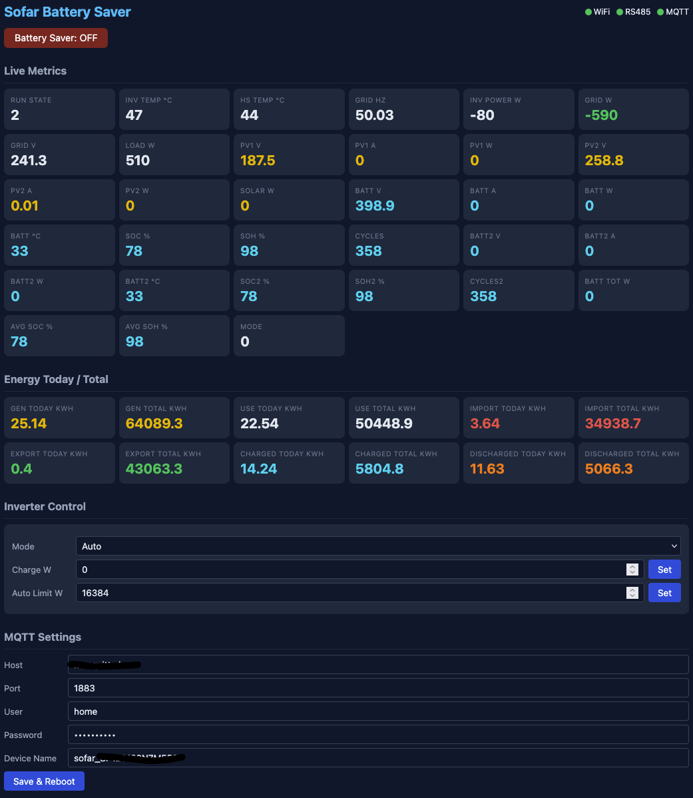
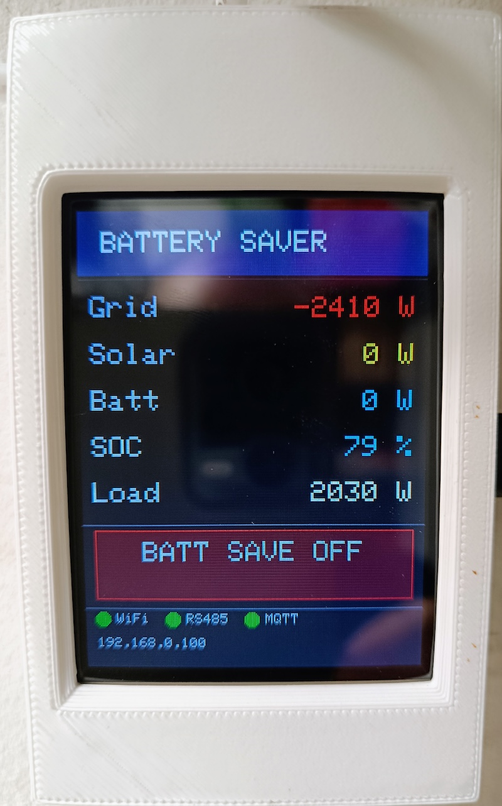

# SofarSolar MQTT

A smart home interface for Sofar HYD-xx00-KTL (HYDV2) solar and battery inverters.

Forked from [Sofar2mqtt](https://github.com/IgorYbema/Sofar2mqtt) and rewritten as a modular, maintainable firmware targeting the **HYD 20 KTL** (HYDV2 register map). Runs on an ESP8266 with a TFT touchscreen and RS485 transceiver (e.g. the [Tindie module](https://www.tindie.com/products/thehognl/esp12-f-with-rs485-modbus-and-optional-touch-tft/)).



## Features

- **Modbus RTU** polling of ~90 HYDV2 registers (system, grid, PV×2, battery×2, energy counters)
- **MQTT** state publishing as a single JSON payload with configurable interval
- **Home Assistant** auto-discovery for ~45 sensors + a battery-saver switch
- **Battery Saver** mode — charges from excess solar, prevents grid discharge
- **ILI9341 TFT** with tabbed UI: live power-flow diagram (PV ⇄ Home ⇄ Grid/Battery arrows) + a system tab (version, IP, RSSI, heap, log tail); touch toggles battery saver
- **Web dashboard** at `http://<device-ip>/` with live data, settings, and battery-saver control
- **WiFiManager** captive portal for first-time WiFi + MQTT setup
- **ArduinoOTA** for over-the-air firmware updates
- **GitHub release self-update** — checks the latest release every 10 min and flashes `firmware.bin` automatically
- **TaskManagerIO** cooperative task scheduling (no blocking delays in the main loop)
- **ArduinoJson v7** for all JSON serialisation

## MQTT Topics

Subscribe to `<deviceName>/state` for a JSON payload containing:

### System
`run_state`, `inverter_temp`, `heatsink_temp`

### Grid
`grid_freq`, `inverter_power`, `grid_power`, `grid_voltage`, `load_power`

### PV
`pv1_voltage`, `pv1_current`, `pv1_power`, `pv2_voltage`, `pv2_current`, `pv2_power`, `pv_total`

### Battery 1
`batt_voltage`, `batt_current`, `batt_power`, `batt_temp`, `batt_soc`, `batt_soh`, `batt_cycles`

### Battery 2
`batt2_voltage`, `batt2_current`, `batt2_power`, `batt2_temp`, `batt2_soc`, `batt2_soh`, `batt2_cycles`

### Battery Totals
`batt_total_power`, `batt_avg_soc`, `batt_avg_soh`

### Energy (kWh)
`today_gen`, `total_gen`, `today_use`, `total_use`, `today_imp`, `total_imp`, `today_exp`, `total_exp`, `today_chg`, `total_chg`, `today_dis`, `total_dis`

### Status
`working_mode`, `battery_save`, `battery_save_target`, `modbus_ok`, `mqtt_ok`, `wifi_ok`, `uptime`

### Commands

These topics require the inverter to be in **Passive Mode**. All commands disable battery saver first, except `/set/battery_save` itself.

- **`<deviceName>/set/battery_save`** — payload `on`, `true`, or `1` enables battery saver. Any other payload disables it.
- **`<deviceName>/set/charge`** — payload is watts. Positive values charge the battery (e.g. `3000`), negative values discharge it (e.g. `-3000`).
- **`<deviceName>/set/standby`** — payload is ignored. Sets inverter to standby (0 W output).
- **`<deviceName>/set/auto`** — payload is watts (e.g. `5000`). Returns the inverter to autonomous mode with a charge/discharge limit of ±N watts. If the value is ≤ 0 or missing, defaults to ±16384 W (effectively unlimited).

### Battery Saver

When enabled, the firmware reads grid power every 3 seconds and adjusts the battery charge target so that only excess solar is stored. The battery **never discharges to the grid** — the charge target is clamped to 0–20000 W (`BSAVE_MAX_POWER`).

### Inverter flash protection

The passive-mode register block lives in the inverter's non-volatile memory, which has a limited write endurance. Writes are therefore minimised aggressively (all constants in `Config.h`):

- Target changes smaller than `BSAVE_MIN_DELTA` (100 W) are **not written** (hysteresis).
- An unchanged command is re-sent at most every `PASSIVE_KEEPALIVE_MS` (45 s) as a keep-alive — the inverter reverts to standby ~60 s without a write.
- When the target stays at 0 W for `BSAVE_IDLE_LAPSE_MS` (10 min — e.g. overnight), writes stop completely and passive mode is allowed to lapse until solar surplus returns.
- All command paths (battery saver, MQTT, web UI) funnel through the same write cache, so redundant mode changes never produce duplicate register writes.

This reduces writes from ~28,800/day (older firmware) to a few hundred on a typical day and **zero at night**.

### Tuning

The protection parameters are runtime-configurable in the web UI (**Battery Saver Tuning** panel) and persisted in EEPROM — no rebuild or reboot needed:

| Parameter | Default | Range | Meaning |
|---|---|---|---|
| Drift (W) | 100 | 20–2000 | Hysteresis: target changes smaller than this are not written |
| Max power (W) | 20000 | 0–20000 | Charge ceiling (matches HYD 20 KTL) |
| Keep-alive (s) | 45 | 5–55 | How often an unchanged command is re-sent (inverter times out ~60 s) |
| Idle lapse (min) | 10 | 1–60 | Sustained 0 W target before writes stop entirely |

All values are clamped server-side — the keep-alive cannot be set short enough to spam the inverter's flash. The compiled defaults in `Config.h` are used for fresh devices.

The battery saver automatically tracks available solar surplus.


## Testing

Unit tests for the safety-critical logic (Modbus CRC, inverter flash-write suppression, battery-saver hysteresis/lapse decisions, EEPROM dirty-guarding) run on the host via a `native` environment:

```bash
pio test -e native
```

or in Docker (what CI does):

```bash
docker build -f Dockerfile.test -t sofar-tests .
docker run --rm sofar-tests
```

GitHub Actions builds the firmware and runs the tests on every push/PR (`.github/workflows/ci.yml`).

## Building

This is a [PlatformIO](https://platformio.org/) project. All dependencies are managed automatically.

```bash
pio run            # compile (also regenerates .clangd for clangd IntelliSense)
pio run -t upload  # flash via USB
```

IDE note: `.clangd` is machine-specific and gitignored; `tools/gen_clangd.py` regenerates it automatically on every build (or run `python3 tools/gen_clangd.py` manually).

### Dependencies (auto-installed)

- Adafruit ILI9341, Adafruit GFX Library
- XPT2046_Touchscreen
- PubSubClient
- WiFiManager
- ArduinoJson v7
- TaskManagerIO

## Hardware

- **MCU:** ESP8266 (ESP-12F), 160 MHz
- **Display:** ILI9341 TFT (SPI) + XPT2046 touch
- **RS485:** Hardware Serial (TX=1, RX=3) to MAX485/MAX3485 transceiver
- **Pins:** TFT CS=D1, DC=D2, LED=D8, Touch CS=0, Touch IRQ=2

Connect RS485 A/B wires to the inverter's 485s port. Power the module from 5V USB.

## Releases & Self-Update

Pushing to `main` triggers the **Release** workflow (`.github/workflows/release.yml`): it stamps `src/Version.h` with a `vYYYY.MM.DD.HHMM` (UTC) version, builds the firmware, and publishes a GitHub release with `firmware.bin`.

Devices poll the repo's latest release every 10 minutes (first check 2 min after boot) and flash new firmware automatically via HTTPS OTA. The comparison uses the version string baked into the running firmware, so a locally-built `v0.0.0-dev` device will pick up the first published release. The web UI's **Firmware Update** panel (`/api/update`) triggers the check immediately.

## Configuration

On first boot (or after factory reset), the device starts a **SofarBatterySaver** WiFi access point. Connect to it and configure:

- WiFi credentials
- Device name (used as MQTT topic prefix and mDNS hostname)
- MQTT host, port, username, password

Settings can also be changed via the web UI at `http://<device-ip>/`.

## Credits

Originally based on [Sofar2mqtt](https://github.com/cmcgerty/Sofar2MQTT) by Colin McGerty.
Version 2.0 rewrite by Adam Hill. Version 3.x by Igor Ybema (TFT, multi-inverter support).
CRC routines by Angelo Compagnucci and JP Mzometa.
HYDV2 rewrite and modularisation by Valentinas Bartusevičius.


